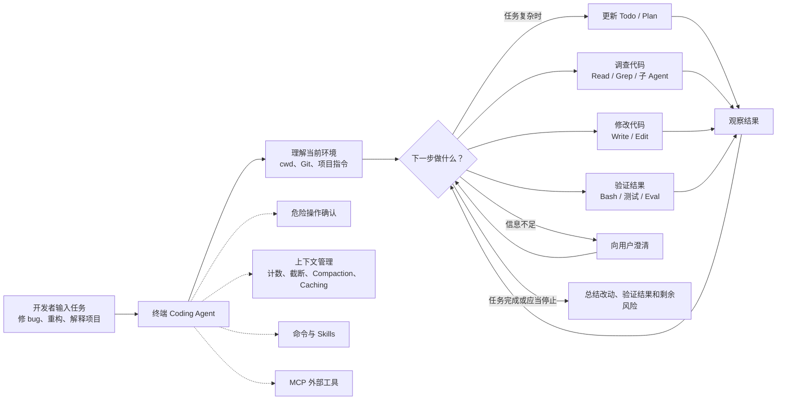
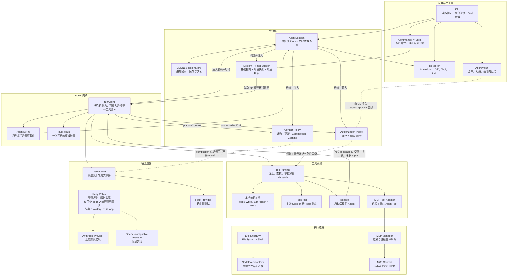
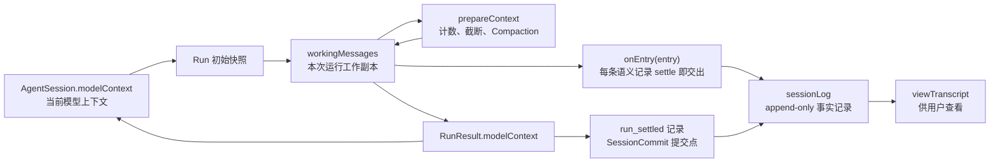
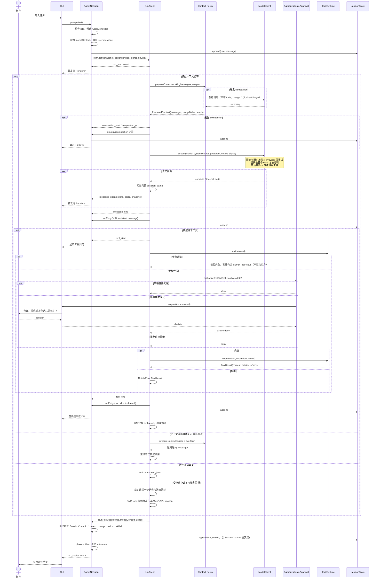
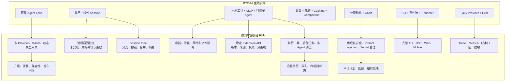

# BYOAA 最终目标设计

> 状态：目标架构
>
> 适用范围：第 16 章完成后的最终参考实现
>
> 最后修订：2026-07-25

> **效力**：本文是终局参考，不是权威源。章节范围以 `OUTLINE.md` 为准，实现约束以 `SPIKE-NOTES.md` 的实测结论为准；三者冲突时先改本文。
>
> **对照实现**：文中援引 pi 的部分基于 commit `5a07388`（2026-06-27）。引用它是为了标定"生产实现在这里怎么做、以及为什么它的做法未必适用于我们"，不是照抄依据——pi 是库，BYOAA 是应用，两者的形状不同。

本文描述《Build Your Own AI Agent》最终会造出什么，以及最终参考实现中各模块的边界、状态所有权和运行语义。

它**不规定中间章节必须提前搭出最终架构**。每一章仍然遵守 BYOX 的渐进原则：只引入解决当前问题所需的最小设计，章末保持可运行，并通过 `chapter-01` 至 `chapter-16` 的 git tag 保留当时的真实形态。最终结构是在这些问题逐步出现后自然收敛出来的结果，不是第一章就要填满的空壳。

本文中的目录名和类型名用于表达职责，可以在实现时调整；真正需要保持稳定的是依赖方向、状态生命周期和运行语义。

## 一、最终产品是什么

BYOAA 的最终成品不是"能聊天的 CLI"，而是一个能在本地完成编码任务闭环的终端 agent：



这里的 Plan、Explore、Change、Verify 不是固定流水线。简单任务可以直接修改，复杂任务也可能先调查再制定计划。真正稳定的核心循环是：

```text
理解当前状态 → 选择动作 → 执行动作 → 观察结果 → 决定继续或结束
```

最终产品的范围是：

- 单用户、本地运行的 CLI。
- 一个 Session 同时只运行一个主任务。
- 默认使用 Anthropic Messages API。
- 能读写代码、执行命令、请求权限、管理上下文、启动只读子 agent、接入 MCP。
- 能保存和恢复线性 Session。
- 能用确定性 eval 检查功能和成本变化。

它复刻的是 Claude Code 一类 coding agent 的**核心机制**，不是功能、协议和安全能力完全等价的生产级替代品。

## 二、目标运行时架构



### 依赖规则

顶层控制关系保持为：

```text
CLI → AgentSession → runAgent → ModelClient / ToolRuntime
```

同时遵守以下边界：

- `runAgent` 不知道终端怎样显示，也不持有跨 Prompt 状态。
- Renderer 只消费事件和快照，不决定 agent 行为。
- Tool 不知道 Session 怎样存档。
- Provider 不知道自己服务的是 coding agent。
- AgentSession 不知道 MCP 使用 stdio、HTTP 还是其他传输。
- 本地工具只依赖 `ExecutionEnv`，不直接散落对 `node:fs` 和 `node:child_process` 的调用。
- TaskTool 通过注入的 child runner 复用 `runAgent`，避免形成源码模块的循环依赖。
- `ExecutionEnv` 的每个可能长时间运行的方法都必须接受 `AbortSignal`，Shell 实现负责三段式结束子进程（关 stdin → SIGTERM → SIGKILL）。取消链在执行边界断掉，等于没有取消链。
- 参数校验属于 `ToolRuntime`，且**发生在授权之前**。非法参数直接返回 `isError` 的 `ToolResult`，不打扰用户；只有结构合法的调用才值得让用户拍板。
- `Authorization` 需要读取 `ToolRuntime` 的工具元数据（危险等级、参数语义）才能判断，因此它依赖注册表的**只读视图**，但不允许触发执行。
- **会话层不许依赖应用层。** `Authorization` 需要问用户时，调的是 CLI 注入进来的 `requestApproval` 回调，它不 import 任何终端代码，也不知道对面是 TUI、编辑器插件还是自动应答的测试桩。上图里这条线画成反向虚线就是这个意思——照着箭头写代码不会写出反向依赖。
- 重试与退避属于 Provider 层，用装饰 `ModelClient` 的方式实现，不进 `runAgent`。**但这层透明性有一条硬边界：只在首个 delta 之前成立**（理由见第五节）。
- **`runAgent` 永不 reject**。任何异常都必须在 run 边界被合成为结构合法的 `RunResult`（failure synthesis）。AgentSession 是单一提交者，它必须无条件拿得到一个结果才能提交。参考实现的教训：pi 把 failure synthesis 放在 `Agent` / `AgentHarness` wrapper 层，绕过 wrapper 直接调用低层 `agentLoop()` 就会拿到 reject——低层自己没有完整的合成逻辑，这是个只在特定调用路径上才暴露的陷阱。
- System Prompt Builder 与 Skills 只影响**送进模型的输入**，不改变 loop 的控制流。斜杠命令在 CLI 层被拦截处理，多数根本不进入 loop。

`runAgent` 会进行网络调用和工具执行，因此它不是数学意义上的纯函数。它的准确定位是：

> 一个无会话状态、可重入、通过依赖注入隔离外部能力的 orchestration kernel。

## 三、状态所有权与生命周期

"一份状态只有一个权威 owner"仍是核心规则，但 owner 不只回答"放在哪个对象里"，还必须回答"它活多久"。

| 生命周期 | 权威 owner | 状态 |
|---|---|---|
| CLI 交互 | CLI / Renderer | 输入缓冲、spinner、折叠状态、当前选中项、权限确认界面 |
| 进程级 | 应用组合根 / MCP Manager | Provider client、工具定义、MCP 连接和外部进程 |
| Session 级 | AgentSession | `modelContext`、模型与会话配置、usage 总账、权限会话记忆（进程内，有意不持久化）、Todo 状态、compaction 配置、**system prompt 的稳定部分**（基础指令、项目指令、已加载 skill）、phase、当前 active run 引用 |
| Run 级 | 一次 `runAgent` 调用 | `workingMessages`、当前 turn、流式 partial、直接 usage、累计 child usage、AbortSignal、**本次运行的环境快照与最终拼装出的 system prompt** |
| Tool invocation 级 | 当前工具执行 | tool call、执行结果、临时 child run、工具内部临时资源 |
| 持久化 | SessionStore | JSONL 的编码、追加、读取和恢复；不拥有 Todo、权限等业务规则 |

### 所有权规则

- AgentSession 的 `modelContext` 是下一次运行的权威模型上下文。
- `runAgent` 总是从 Session 快照创建 `workingMessages`，不能半路修改 Session 数组。
- Todo 的操作和内部表示由 TodoTool 封装，但它的生命周期和持久化边界属于 Session。Todo 不能通过模块级全局变量泄漏到其他 Session 或子 agent。**这条推翻 SPIKE-NOTES D5 遗留待办里的"todo 改 per-run"**：D5 的病根是模块级全局（跨 Session 串味），不是作用域太大；真降到 run 级，用户下一次 prompt 时 todo 列表就空了，而多轮 prompt 推进同一个任务恰恰是它存在的理由。正确的修法是 Session 级 + 显式注入，不是 per-run。
- usage ledger 只有 AgentSession 一个写入者。子 agent 返回自己的 usage，由父 run 逐层汇总，不能直接修改全局账本。
- system prompt 分两段所有权：**稳定段**（基础指令、工具说明、项目指令、已加载 skill）属于 Session，是 prompt caching 断点的落点；**易变段**（cwd、git 状态、时间）属于 Run，每次运行重建。二者的拼接顺序必须让稳定段在前，否则 ch08 的 cache 断点每轮失效。
- MCP 连接不随每次 Prompt 重启。它由 MCP Manager 管理，并在 CLI 退出时统一关闭。
- MCP server 连接失败或中途失联**不是致命错误**。启动时连不上要降级（跳过该 server、告知用户、agent 照常可用），运行中失联要把该 server 的工具从注册表下架，而不是让模型继续调用一个已经死掉的进程。一个外部依赖不该拖垮整个 agent。
- 下架有两个必须一起处理的连带后果：(1) **模型仍会调用它**——上下文里还留着那些工具的定义和调用历史，所以 `ToolRuntime` 遇到未注册的工具名必须返回 `isError` 的 `ToolResult`（"该工具已不可用，请换一种方式"），走可恢复错误那条路，而不是抛异常终结 run；(2) **`tools` 数组一变，prompt cache 前缀就失效**，下一轮是一次全量 cache miss。这不是不下架的理由，但它意味着"下架"是有价格的动作，不该在每次瞬时抖动时反复触发。
- 每次主 run 新建一个 AbortController。子 agent 和工具接收其 `signal`，形成单向取消链。
- Session 只保存 active run 的句柄，不需要把每个 child run 提升为 Session 级状态。
- SessionStore 负责"怎样存"，AgentSession 决定"存什么"。Store 不理解 Todo、权限策略或 compaction 的业务含义。
- **历史是流水，状态是快照，两者用不同机制。** `sessionLog` 增量追加、只增不改；Session 级状态（`modelContext`、usage ledger、Todo、已加载 skill）在 run settle 时作为一个 `SessionCommit` 原子提交。详见第四节。

## 四、四种容易混淆的记录

最终实现必须明确区分以下概念：



### `modelContext`

下一次发给模型的 messages。它允许被 compaction 有损改写，因此不是完整历史档案。

### `workingMessages`

一次 run 私有的工作副本。流式 partial、尚未配对完成的 tool call 都只能先存在这里，不能直接污染 Session。

### `sessionLog`

JSONL 中 append-only 的事实记录。它保存已经 settle 的用户消息、assistant 消息、工具调用、工具结果、compaction 记录、usage 和运行结局。

compaction 可以替换 `modelContext`，但不应假装此前发生过的消息和工具调用从未存在。被压缩掉的内容仍可留在 `sessionLog` 中。

#### 写入时机：一条记录 settle 就写一条

"单一提交者"约束的是**谁写**，不是**什么时候写**。只有 AgentSession 能调 `store.append`，但它应当在每条记录变成不可变事实的那一刻就写，而不是攒到 run 结束一次性倒出来：

| 时刻 | 追加什么 |
|---|---|
| 用户输入被接受（run 尚未开始） | user message |
| 一条 assistant message 流式完成 | 完整 assistant message |
| 一次工具调用结束 | tool call + tool result |
| 一次 compaction 完成 | compaction 记录（含被压缩区间与 `CompactionDetails`） |
| run settle | 运行结局 + **Session 提交点（`SessionCommit`，见下）** |

由此得到一条一句话规则：**能进语义记录的时刻，就是能进 `sessionLog` 的时刻**。ch10 的记录时机和事件时机是同一批时刻，不需要两套。

#### 原子性归 `modelContext`，不归日志

两者本来就不对称，不该绑在同一次提交里：

- `sessionLog` 回答"发生过什么"。发生过就是发生过，run 失败也发生过，因此**增量追加、永不回滚**。
- `modelContext` 回答"我该带着什么继续"。它才需要原子提交：要么整个 run 的结果生效，要么保持 run 之前的状态。

恢复规则随之变干净：**读到最后一条 `run_settled` 记录为止**，用它记录的提交点还原 Session 状态；它之后的碎片记录只进 `viewTranscript`，不进模型上下文。

这个选择的教学收益是可以当场演示的。跑一个长任务，中途 `kill -9`，然后 `cat session.jsonl`——碎片全在，能看见 agent 死前干到哪一步；`resume` 之后 agent 从上一个干净边界继续。攒到最后再写的方案，同一个 demo 得到的是一个空文件，读者只会得出"JSONL 白写"的结论。

#### 提交点带什么：`SessionCommit`

`modelContext` 不是 Session 级状态的全部。第三节列的 Session 级状态里还有 Todo、usage 总账、已加载 skill、权限会话记忆，恢复时如果只还原 `modelContext`，剩下的会各自出问题——最刺眼的是 Todo：`modelContext` 里留着 TodoWrite 的调用历史，TodoTool 却是一张空表，模型会看见一个自相矛盾的世界。

所以 `run_settled` 携带的是一个完整的提交点：

```ts
interface SessionCommit {
  modelContext: Message[]
  usage: Usage          // 会话累计，跨 resume 继续累加
  todos: Todo[]
  loadedSkills: string[]
}
```

**权限会话记忆有意不在里面。** 这不是遗漏，是安全决策：`resume` 可能发生在几天之后，让用户在上一次会话里点过的"本会话总是允许"继续生效，等于一次静默扩权，而那时用户对自己授权过什么已经没有记忆了。"本会话"就该字面地指这一次进程内的会话。正文必须把这条理由写出来——不写理由，后来的人会把它当 bug 修掉。

由此 `SessionStore` 的分工也更清楚了：它负责把 `SessionCommit` 编解码成 JSONL，但不理解 Todo 是什么、skill 怎么加载。AgentSession 决定存什么，Store 只负责怎么存。

**代价要认领：每次 run settle 都写一份完整快照，日志大小随 run 数线性增长**（`modelContext` 有 compaction 兜着上限，所以是线性不是爆炸）。省空间的做法是只存"重放指令"——哪些 entry 进上下文、compaction summary 引用哪条记录——恢复时重放得到 `modelContext`。正文不这么做：重放逻辑必须与 compaction 的切点规则永远保持一致，一旦漂移就是恢复出一份与当时不同的上下文，而这种 bug 极难发现。存全量快照换来的是"恢复=反序列化"，这个简单性对一本教学书值这点磁盘。

### `viewTranscript`

用户在终端查看的记录。它可以由 `sessionLog` 派生，也可以只显示当前 Session 的一部分；它不是模型上下文本身。

当前课程只承诺线性 Session 的保存与恢复，不承诺进程在任意指令中间崩溃后自动续跑。未完成工具的幂等、重放和外部副作用恢复属于成熟系统能力。

## 五、一次 Prompt 怎样执行



### 三个关键挂点

- `prepareContext` 在每次模型请求前运行，因此单次长 tool chain 也能及时截断或压缩；它同时是溢出后反应式压缩的入口（`trigger` 参数区分两种来由，压缩逻辑只有一份）。注意它**自己会发起模型调用**（compaction 的总结调用），所以 Context Policy 也持有一个 `ModelClient`——必须是同一个已经套过 retry 装饰器的实例，否则总结调用会在限速时裸奔。`runAgent` 不是唯一调用模型的地方，但 usage 仍然只有一条汇总路径。
- `authorizeToolCall` 负责策略判断，CLI 的 `requestApproval` 只负责与用户交互。权限规则和权限 UI 不混在一起。
- `ToolRuntime.execute` 将可预期的工具失败编码进 `ToolResult`，让模型看到错误并自我修正，而不是用异常打断整个 loop。

关于顺序还有一条容易写反的规则：**校验 → 授权 → 执行**。把授权放在校验前，用户就会被要求为一个参数根本不合法的调用做决定；那种打扰既没有安全收益，还会训练用户无脑点"允许"。

### run 级结局

先分清两个层次，混在一起是这里最常见的错误：

- **turn 级 stop reason** 是 provider 的事实，描述"这一次模型调用为什么停"：`end_turn` / `max_tokens` / `tool_use` / `refusal` / `pause_turn` / `model_context_window_exceeded`。它原样保留、进 `sessionLog`。（`stop_sequence` 只在传了 `stop_sequences` 参数时才可能出现，正文不传，因此它不进我们的类型——用不上的东西不建模。）
- **run 级 outcome** 描述"整个 loop 为什么结束"。它由 `runAgent` 自己推导。

`tool_use` 就是这条分界线的证据：在 turn 层它是完全合法的终态，在 run 层它根本不是结局——工具跑完还要接着转。

```ts
type RunOutcome =
  | { reason: "end_turn" }
  | { reason: "max_turns" }
  | { reason: "user_abort" }
  | { reason: "output_truncated" }
  | { reason: "context_exhausted" }
  | { reason: "failed"; error: AgentRunError }
```

#### 为什么我们需要它，而参考实现不需要

pi 没有 run 级结局层，终态要从最后一条 `AssistantMessage.stopReason`（`stop` / `length` / `toolUse` / `error` / `aborted`）去推。而且它是**主动**扁平化的：OpenAI/Codex provider 递给它一套 run 味道的状态（`completed` / `incomplete` / `failed` / `cancelled` / …），它转手压成三个 stopReason。

原因在形状，不在品味：

- pi 的 `agentLoop()` 是 EventStream，**由调用方驱动**。turn cap 是调用方的 `shouldStopAfterTurn`，abort 也是调用方发的。"为什么停"有一半本来就在调用方手里，pi 只报它那一半就够了。
- 我们的 `runAgent(...)` 是**一次黑盒调用**，`maxTurns` 和 abort 处理都在里面。AgentSession 调完之后，除非 runAgent 告诉它，否则它无从知道是"模型说完了"还是"转够十轮了"。

**pi 不需要，是因为它是库；我们需要，是因为我们是应用。**

#### 从 turn 级推导 run 级：这是推导，不是查表

同一个 provider 信号在不同的 loop 状态下含义不同，所以不存在一张无损的映射表。必须结合 loop 自己的控制状态和这一轮实际吐出来的内容：

| turn 级事实 | loop 还需要知道 | run 级结局 |
|---|---|---|
| `tool_use` / `pause_turn` | — | **不是结局**，继续下一轮 |
| `end_turn` | — | `end_turn` |
| `refusal` | — | `end_turn`（模型不会靠再转一轮自我修正，直接 settle） |
| `max_tokens` | 最后一个 block 是不是完整的 `tool_use` | 完整 → `output_truncated`；残缺 → 丢弃半条 message、提高预算重试 |
| `model_context_window_exceeded` | 本 run 是否已经反应式压缩过 | 没压过 → **不是结局**，压缩后重试；压过 → `context_exhausted` |
| —（loop 自判） | `turn == maxTurns` | `max_turns` |
| —（signal 触发） | `signal.aborted` | `user_abort` |
| provider 抛错且重试耗尽 | — | `failed` |

`max_tokens` 那一行是"光看 stop_reason 不够"最硬的实证：截断可能砍在一个 `tool_use` block 中间（SPIKE-NOTES D1 协议速查记下的坑）。两种情况的 stop_reason 完全相同，loop 该做的事却相反——block 完整就当"回答被截断"收尾；block 残缺则连结构合法的 messages 都拼不出来，只能丢掉这半条 assistant message、提高 `max_tokens` 重试。要分辨它必须去读 content 的结构，任何一张 stop_reason 映射表都给不出答案。

**溢出不要从 `max_tokens` 猜。** Claude 4.5 起，input + max_tokens 超窗不再 400，而是照常生成、撞顶后回 `stop_reason: "model_context_window_exceeded"`（旧模型仍在请求校验阶段报错，那条路走 `failed`；见 SPIKE-NOTES D4 查证）。它有自己的信号，不需要靠"`output_tokens == 0` 且 input 接近窗口"这类启发式去推——推出来的规则既不准，也会在换模型时悄悄失效。

#### 溢出后的反应式压缩

上表里 `model_context_window_exceeded` 那一行引入了第二条压缩路径，它需要被显式安排，否则就会变成 loop 里一段随手写的 if：

- **入口仍然只有一个。** `prepareContext` 接受触发原因：`prepareContext(messages, usage, { trigger: "pre-request" | "overflow" })`。主动压缩是"请求前按阈值查"，反应式压缩是"请求后被 provider 打回来"，但压缩算法、安全切点和 usage 记账共用同一条路径。两个入口意味着两份切点逻辑，而切点写错就是 400。
- **每个 turn 最多反应式压缩一次。** 压完重试仍然溢出，就 settle 为 `context_exhausted`，不再循环。
- **压缩无进展也要停手。** 若压缩后的 token 数没有明显低于压缩前（上下文已经贴着地板），直接 settle。这是 D4 阈值 thrash 的近亲：那次是白烧总结调用，这次还要额外搭上一次注定失败的主调用。
- 反应式压缩照常发 `compaction_start` / `compaction_end` 事件和 `onEntry` 记录，`sessionLog` 里能看出这次压缩是被溢出逼出来的，而不是按阈值触发的。

#### 刻意不做的分组

正文**不**在 reason 之上再加一层 `completed / stopped / failed` 状态分组。理由：discriminated union 已经能让非法状态不可表示（`failed` 必须带 `error`）；需要分桶的消费者（eval 判分、CLI 文案）写一个 helper 就够；而 reason 集合在 ch10 基本定型，"加 reason 不用改 switch"这个收益吃不到。

**分桶 helper 归 `eval/`，不归 `agent/`。** 放进内核就等于承认三态是官方概念、只是恰好没进类型；放在消费者那边才是真的不承认。这样保持内核最小，也让"要不要提升成类型"这个问题在 ch15 自然浮现，而不是提前给答案。

如果写到 ch15 时 eval 真的被 reason 的增删折腾到了，**那时候再把分组提升成类型**——那次提升本身就是一节好教材，比在文档阶段先把抽象定死更符合本书的原则。

#### 无论哪种结局

- 都必须 settle，并返回结构合法的 `RunResult`。
- 已经产生的 usage 都要计入总账。
- loop 内部实际只有两种收尾处理：正常结束直接返回；其余一律先**裁到最后一个结构合法的 tool_use / tool_result 配对**再返回。这也是不需要三态分组的一个佐证——真正分叉的地方只有两处。
- 重试策略（限速退避、瞬时故障）在 `ModelClient` 的装饰实现里，`runAgent` 里不应出现任何 retry 循环。

工具造成的外部副作用不参与 messages 的原子提交。比如文件已经写入后用户按下 Ctrl+C，文件不会自动回滚；Session 必须如实记下 `user_abort` 和已经发生的那次写入，而不能假装这次 run 从未发生。进程突然崩溃时的副作用恢复不在正文范围内。

#### 重试的透明性到首个 delta 为止

"loop 只看到一次调用成功或最终失败"是个好目标，但流式下它只在**首个 delta 之前**成立，这一点必须写进正文，否则就是用抽象掩盖一个做不到的承诺：

Anthropic 的流不可续接，重试就是重发整个请求。而装饰器一旦已经把 delta 转发给下游——Renderer 画到了屏幕上，`workingMessages` 的累加器收了半条 assistant message——重发就会产生重复内容。透明性在第一个 delta 离开装饰器的那一刻就失效了。

三档取舍，正文取第一档：

1. **首个 delta 之前透明重试，之后中断即本次调用失败**（正文选择）。限速（429）和连接建立阶段的 5xx 恰好都发生在这个窗口内，覆盖了绝大多数真实故障，而且不需要下游配合。
2. 允许流中断后重试，但向下游发一个 `stream_restart` 信号，让 loop 丢弃本轮 partial、Renderer 回退已渲染内容。能救更多情况，代价是透明性没了、事件协议多一个状态、Renderer 要能撤销。
3. 缓冲到整条 message 完成再放行。透明性最完整，但等于放弃流式。

选第一档还有一个连带约定：**partial 的丢弃责任在 `runAgent`，不在装饰器**。装饰器负责判定"这次调用最终失败了"，loop 负责把已经累加的半条 assistant message 丢掉、不让它进 `workingMessages`。装饰器不该反过来去清理调用方的状态。

这是流式 mini-spike 必须当场验掉的问题之一（见第七节）。

## 六、核心运行协议

### `RunResult` 是权威结果

事件用于观察过程，不能成为提交 Session 状态的唯一数据源。最终状态由 `runAgent` 返回的 `RunResult` 决定：

```ts
interface RunResult {
  outcome: RunOutcome
  modelContext: Message[]
  directUsage: Usage
  childUsage: Usage
  totalUsage: Usage
}
```

- `modelContext` 是 settle 后下一轮应继续使用的上下文，可能已经经过 compaction。
- `directUsage` 包含本次 run 直接发起的模型调用，包括 compaction 总结调用。
- `childUsage` 是所有子 agent usage 的递归汇总。
- `totalUsage = directUsage + childUsage`。

**`RunResult` 里没有 `historyEntries`。** 语义记录通过注入的 `onEntry(entry)` 回调在 settle 的那一刻实时交出，不攒到最后（理由见第四节）。这让 `RunResult` 权威的东西变得更纯粹：**它权威的是状态，不是历史**。历史是流水，走回调；状态是快照，走返回值。

`onEntry` 是依赖注入的槽位，和 `prepareContext` / `authorizeToolCall` 同一类，**不是 AgentEvent**：它同步、必达，调用方必须提供。观察协议允许 Renderer 丢事件，记录协议不允许。

#### `onEntry` 不允许抛错

"必达"和"落盘"之间隔着一层异步 IO，契约必须写死，否则它就是那种只在磁盘满的时候才暴露的陷阱：

- **`onEntry` 同步返回、永不抛错。** AgentSession 在回调里做的是"把 entry 推进一个保序的写入队列"，真正的 `store.append` 在队列里异步执行。队列必须保序——JSONL 记录乱序等于日志作废。
- **落盘失败降级为一次警告，不终结 run。** 这是一个价值排序：日志坏了不该毁掉一个正在跑的编码任务。同时它也守住了另一条边界——`runAgent` 永不 reject 的保证，不该被一个调用方注入的回调击穿。
- 反过来的立场（append 失败即 `failed`）也讲得通，但那必须是**明写的选择**，而不是因为谁忘了 `try/catch` 而变成的默认行为。正文选前者，并在 ch10 说明为什么。

内核交出的是 `RunEntry`——一条纯语义记录，不含任何持久化格式。把它编码成 JSONL 的 `SessionEntry` 是 `session/records.ts` 的事。这样"`runAgent` 不知道 Session 怎样存档"这条边界才真的成立，而不是靠命名假装成立。

**`onEntry` 到 ch10 才出现，ch05 的回调槽位里不预留它。** 提前挖一个空槽位，读者只会问"这是干嘛的"；等 ch10 真的需要持久化时再改 `runAgent` 的签名，那次签名变更本身就是渐进式构建该有的时刻，值得当作教学内容写出来，而不是藏起来。

这个区分有个具体后果：**子 run 的记录不进主 `sessionLog`**。TaskTool 给子 agent 注入的是一个收集到内存的 `onEntry`，主日志里只留下"调用了 task 工具 + 摘要 + usage"这一条 tool result 记录。否则一次子 agent 调查就能把主日志淹掉（D5 实测子 run 烧掉 26639 token）。这一点与 pi 的做法一致——它的 subagent 示例也是把子结果压成父级的一条普通 tool result，`details` 里放完整信息。

**我们与 pi 在 usage 上分道**：pi 把子 run 的 usage 留在 `details` 里，父账本不含它；我们递归汇总进 `childUsage`。理由是 D5 的实测数字——父报 2603、子烧 26639，不汇总等于成本完全不可见。这是一个有意识的分歧，不是疏忽，正文里要说明。

### `AgentEvent` 是观察协议

建议的事件族：

```text
run_start
message_start / message_update / message_end
tool_start / tool_update / tool_end
compaction_start / compaction_end
child_start / child_end
run_settled
```

其中：

- `message_update` 可以携带 delta 和当前 partial 快照，服务流式 Renderer。
- 事件是**观察**协议，允许有损：Renderer 丢失某个 update 不应改变最终 Session 状态，也不应丢记录——记录走 `onEntry` 回调，不走事件。
- `message_end` / `tool_end` / `compaction_end` 与 `onEntry` 的调用时机重合，但职责不同：前者给 Renderer 看，后者给 SessionStore 落盘。
- `run_settled` 是结果的观察事件，不替代 `RunResult`。

### `ToolResult` 分离模型内容与本地详情

```ts
interface ToolResult {
  content: string
  isError?: boolean
  details?: unknown
}
```

- `content` 会编码进 tool result 发给模型，必须受长度和敏感信息策略约束。
- `details` 服务 Renderer、diff 展示和本地诊断，默认不进入模型上下文。
- 可预期错误使用 `isError` 返回，loop 继续；程序不变量被破坏等开发错误仍可以抛出，逃到 run 边界后由 failure synthesis 合成 `{ reason: "failed", error }`。**判据是"模型能不能靠这条信息自我修正"**：能，就编码进 `ToolResult`；不能，才让它逃出去终结这次 run。

**"把错误编码进返回值"优于"抛异常表示失败"，这一点有现成的反面实证。** pi 的契约是反过来的：工具失败**必须 throw**，正常 resolve 的结果一律当成功。结果它自己的 subagent 示例失败时返回了 `{ isError: true }`——而这个字段在 `AgentToolResult` 类型上根本不存在，于是错误永远传不到父级。一份生产代码库的官方示例用错了自己的错误契约，这就是"易错契约"最好的证据。ch10 讲三段式时可以直接拿它当"为什么需要它"。

**`content: string` 是一个刻意的取舍，不是疏忽。** Anthropic 的 tool result 本身允许 content block 数组（可含图片），MCP 的 `tools/call` 也会返回非文本 block。正文选择把 `content` 限定为字符串，因为多模态会给每个工具、每次截断、每次 compaction 都增加一层分支，而全书没有一个教学场景真正需要它。由此产生两条必须遵守的后果：

- MCP Tool Adapter 负责降级：非文本 block 转成简短占位文本（如 `[image 1024×768, 已省略]`）进 `content`，原始 block 完整保留在 `details` 里供 Renderer 使用。
- ch13 必须**明说**这个降级，而不是让读者以为手写的 MCP client 已经协议完备。

如果将来要支持多模态，改动点是 `ToolResult.content` 的类型、截断策略和 provider 编码这三处——这是可控的局部修改，正是现在敢于收窄的理由。

## 七、最终需要实现的模块

最终参考实现计划位于仓库的 `code/` 下。建议结构如下，名称可调整：

```text
code/
  package.json
  src/
    agent/
      types.ts                 # Message、RunResult、RunOutcome、Usage
      events.ts                # AgentEvent 观察协议
      entries.ts               # RunEntry 记录协议（与 events 分开，职责不同）
      run-agent.ts             # 核心模型—工具循环
      context-policy.ts        # prepareContext 接口
      authorization.ts         # authorizeToolCall 接口

    session/
      agent-session.ts         # 跨 Prompt 状态与单一提交者
      records.ts               # RunEntry → SessionEntry / JSONL 编码
      jsonl-store.ts           # 追加、读取、恢复
      compaction.ts            # 双参数阈值、安全切点、结构化锚点

    prompt/
      system-prompt.ts         # 分层组装：稳定段在前、易变段在后
      environment.ts           # cwd、git 状态、目录结构采集
      project-instructions.ts  # CLAUDE.md 式项目记忆

    tools/
      types.ts                 # AgentTool / ToolResult / ToolExecutionContext
      runtime.ts               # registry、校验、dispatch
      read.ts
      write.ts
      edit.ts
      bash.ts
      grep.ts
      todo.ts
      task.ts                  # 只读子 Agent

    execution/
      execution-env.ts         # FileSystem + Shell 接口
      node-execution-env.ts    # Node 本地实现

    providers/
      model-client.ts          # 正文需要的最窄模型边界
      retry.ts                 # 退避重试装饰器，包裹任意 ModelClient
      anthropic.ts             # 默认 Provider
      faux.ts                  # 确定性测试 Provider
      openai-compatible.ts     # 附录实现

    mcp/
      client.ts                # JSON-RPC、initialize、tools/list、tools/call
      manager.ts               # 连接、进程、abort、stop、失败降级与工具下架
      tool-adapter.ts          # MCP Tool → AgentTool（含非文本 block 降级）

    commands/
      registry.ts              # 斜杠命令：/help、/compact、/resume
      skills.ts                # skill 发现与按需加载

    app/
      cli.ts                   # composition root、输入循环
      renderer.ts              # 流式 Markdown、Diff、折叠
      permission.ts            # 终端确认交互

    eval/
      fixtures.ts              # 固定任务集
      outcome-buckets.ts       # RunOutcome → 通过 / 未完成 / 出错（消费者侧分类）
      scorer.ts                # 确定性判分
      report.ts                # 通过率、token 与成本报告
```

模块目录不是教学顺序。某个中间 tag 完全可以只有几个文件；当重复职责和真实设计压力出现后，再重构到最终形态。

### 正文主线必须完成

- Anthropic Messages API 的 fetch 教学版与 SDK 最终版。
- `AgentTool`：声明与执行的统一接口。
- `ToolResult`：`content`、`details`、`isError` 分离。
- `ExecutionEnv`：FileSystem 与 Shell 的可替换执行边界。
- `runAgent`：无会话状态、可重入的模型—工具循环。
- `RunResult` 与 `RunOutcome`：turn 级 stop reason 与 run 级结局的分层，以及**结合 loop 控制状态与本轮实际内容推导 run 级 reason**（不是查表；`max_tokens` 砍在 `tool_use` block 中间是最好的例子）。
- `AgentEvent`：流式过程观察协议；以及它与 `onEntry` 记录协议的分工（观察允许有损，记录不允许）。

  > **未验证依赖**：事件协议的形状取决于流式的形状，而流式在 spike 周零接触（D7 定的落点是第二部分开头的 ch06，不是 ch14——ch14 只剩终端打磨）。写 ch05 之前必须先跑一次串通「流式 → 事件协议 → 最小 renderer」的 mini-spike（估一天），否则 ch05 定下的回调槽位形状会在 ch06 就被推翻，连带 ch10 返工。这次 mini-spike 至少要当场回答三件事：`message_update` 带 delta 还是带 partial 快照（还是都带）、`input_json_delta` 碎片重建后 tool call 在哪个时刻算 settle、以及**流中途断掉时已经吐给 Renderer 的内容怎么收场**（第五节选了"首个 delta 之后不再透明重试"，需要实测确认这个窗口覆盖了真实的 429/5xx）。
- **system prompt 的分层组装与环境感知**：基础指令、工具说明、cwd / git 快照、CLAUDE.md 式项目指令，以及稳定段在前、易变段在后的排序纪律。
- `prepareContext` 和 `authorizeToolCall`。
- AgentSession：model context、usage ledger、permission memory、Todo、active run。
- 每轮独立 AbortController 和向下传播的 AbortSignal，直至 `ExecutionEnv` 的子进程。
- **Provider 层的限速退避重试**，以及它为什么不能写进 loop、为什么它的透明性只到首个 delta 为止。
- token 计数、大输出截断和 prompt caching。
- compaction 的触发阈值、安全切点、原始任务锚点和硬事实保留；其中阈值必须用 `reserveTokens` 与 `keepRecentTokens` 双参数解耦"压缩后地板"和"触发线"，否则真实 summary 会把地板顶过阈值、导致每轮重压反而更烧钱。此外还有溢出后的反应式压缩路径：与主动压缩共用 `prepareContext` 入口，每 turn 最多一次，压缩无进展即 settle 为 `context_exhausted`。
- append-only JSONL 线性 Session：**每条记录 settle 即写**，`run_settled` 记录携带 `SessionCommit`（`modelContext` + usage + Todo + 已加载 skill，**权限会话记忆有意不入**）；恢复读到最后一条 `run_settled` 为止。日志增量、上下文原子，两者不绑同一次提交。ch10 必须交付**真实的崩溃演示**——长任务跑到一半 `kill -9`，`cat session.jsonl` 看见碎片，`resume` 从上一个干净边界续上。这个 demo 是"日志记录事实、上下文记录状态"唯一的眼见为实，不能用文字带过。
- ToolRuntime 与本地 coding tools；参数校验先于授权。
- TodoTool（Session 级作用域，不得经模块级全局变量泄漏到其他 Session 或子 agent）。
- 只读子 agent，child usage 向父级汇总，**以及子 agent 结论的可校验性**：父 agent 必须能对子 agent 的回答做最低限度的验证（要求带上文件路径 / 行号 / 命令输出等可复查证据），不能把一段自信的自然语言当作事实。
- MCP client、动态工具适配、进程生命周期，以及连接失败与运行中失联的降级路径。
- 命令与 Skills 的渐进加载。
- Faux Provider 与确定性 eval。
- 流式终端 Renderer。

### 附录或练习与延伸

- OpenAI-compatible Provider。
- steering / follow-up queue。
- 并行只读工具执行。
- 工具流式进度。
- 写操作子 agent 的 git worktree 隔离。
- Session label、简单 fork 或 transcript 导出。
- prompt template。
- project trust。

## 八、按问题驱动的演进路线

下面描述能力为什么按这个顺序出现。它与课程章节一致，但**不要求每一章的目录和类型已经等同于最终结构**。

```mermaid
flowchart TB
    C01["01 一次 API 调用<br/>无状态聊天 CLI"]
    C02["02 Tool Use<br/>模型能请求一个动作"]
    C03["03 Agent Loop<br/>messages 历史 + 循环直到完成"]
    C04["04 Write / Edit<br/>ExecutionEnv + Diff"]
    C05["05 Bash + fetch 毕业<br/>自我迭代闭环 + 可注入 runAgent"]

    C06["06 系统提示词与环境感知<br/>buildSystemPrompt + SDK 流式通道"]
    C07["07 权限系统<br/>authorizeToolCall"]
    C08["08 token 感知<br/>计数、截断、Caching"]
    C09["09 Compaction<br/>prepareContext + 安全切点"]
    C10["10 健壮性与 Session<br/>错误协议、Abort、JSONL、AgentSession"]

    C11["11 子 Agent<br/>隔离 messages + 复用 runAgent"]
    C12["12 计划、命令与 Skills<br/>扩展行为而不改核心 loop"]
    C13["13 MCP<br/>动态外部工具 + 生命周期"]

    C14["14 终端体验<br/>把既有事件流渲染清楚"]
    C15["15 Eval<br/>Faux Provider + 确定性判分"]
    C16["16 发布<br/>npm 包 + 干净环境冒烟测试"]

    C01 -->|"模型只能说，不能行动"| C02
    C02 -->|"一个工具调用完不成真实任务"| C03
    C03 -->|"需要安全地写和精确地改"| C04
    C04 -->|"需要运行测试并根据结果继续"| C05

    C05 -->|"Agent 必须理解自己所在的项目"| C06
    C06 -->|"危险能力不能静默执行"| C07
    C07 -->|"上下文和账单开始失控"| C08
    C08 -->|"只看见窗口还不够，还要压历史"| C09
    C09 -->|"状态、取消和故障分散在各处"| C10

    C10 -->|"调查任务污染主上下文"| C11
    C11 -->|"长任务容易漏步骤，行为需要复用"| C12
    C12 -->|"需要接入仓库外的能力"| C13

    C13 -->|"功能可用但终端信息混乱"| C14
    C14 -->|"主观感觉无法证明能力变好"| C15
    C15 -->|"需要让别人稳定安装和复现"| C16
```



这张图表达的是：

> 每个最终抽象都应当有一个读者亲眼见过的问题作为来由。

## 九、BYOAA 与成熟 Agent 平台的边界



正文必须明确告诉读者：

- abort 不等于崩溃恢复。
- 权限弹窗不等于沙箱。
- `ExecutionEnv` 是替换执行后端的边界，不自动提供安全隔离。
- JSONL 不等于事务数据库或分布式持久化。
- 只读子 agent 不等于多 agent orchestration；子 agent 的回答也不因为"它调查过"就更可信，压缩过的子上下文一样会丢事实。
- 内部 callback 不等于稳定的 extension 生态。
- usage 统计不等于完整 observability。
- Faux Provider 和固定任务集不等于覆盖开放世界行为的完整评测体系。

这些不是缺陷伪装成"以后再做"，而是课程为保持可理解、可手写和几千行规模而主动划定的范围。

## 十、这些图分别放在哪里

| 内容 | 建议位置 | 作用 |
|---|---|---|
| 最终产品闭环 | 导言 | 展示最终会造出什么，不提前灌输模块名 |
| 运行时架构（裁剪版：Core + ToolSystem + Provider 三块） | 第一部分结束 | 只画读者已经亲手写过的部分，作为 fetch 毕业后的一次收束 |
| 运行时架构（中版：加 App + SessionLayer + Execution，仍不含 Task / Skills / MCP / Faux） | 第 10 章结束 | 第二部分的收束；此时读者手上的 agent 恰好就长这样 |
| 目标运行时架构（完整版） | 第 13 章结束；README 最终版 | 子 agent、Skills、MCP 都落地之后，才给终局地图 |
| 状态所有权与生命周期 | 第 10 章（裁掉 Todo / skill / MCP 三行）；第 13 章补全 | 解释为什么散落状态需要收敛到 AgentSession |
| 四种记录 | 第 9–10 章之间 | 讲清 compaction、持久化与用户可见历史的区别 |
| 完整 Prompt 时序 | 第 10 章结束 | 汇总权限、compaction、流式、工具错误和 Session 提交（这张图里的每一块 ch10 都已建好，可以整张给） |
| 最终模块结构 | 开发文档或第 16 章 | 指导最终代码整理，不作为早期章节脚手架 |
| 问题驱动演进路线 | 大纲与每部分开头 | 说明抽象为什么出现 |
| 成熟平台边界 | 结尾与延伸阅读 | 建立正确工程视野，防止夸大成品能力 |

导言只需要展示产品闭环和最终效果，不应一次性放出全部架构细节。完整时序图和收敛后的状态图等第 10 章的 AgentSession 落地后给出；**完整架构图要再等三章**。

这条排布本身受第八节那句原则约束：**每个最终抽象都应当有一个读者亲眼见过的问题作为来由**。在第一部分结束时抛出一张含 Session、Context Policy、Authorization、MCP 的六块大图，等于用一堆读者还没遇到过的名词去换一点"看起来很专业"，这正是本书要避开的写法。

同一把尺子量到 ch10 也一样：第二节那张完整图里含 `Task`（ch11）、`Commands 与 Skills`（ch12）、`MCP Manager`（ch13）、`Faux Provider`（ch15），ch10 的读者一块都没亲手写过。所以架构图分三档递进——第一部分末的三块裁剪版、ch10 末的中版、ch13 末的完整版——每一档都只画读者手上真实存在的东西。图的价值在于"这就是我刚写完的那个系统"，一旦掺进还没发生的模块，它就退化成一张宣传画。
