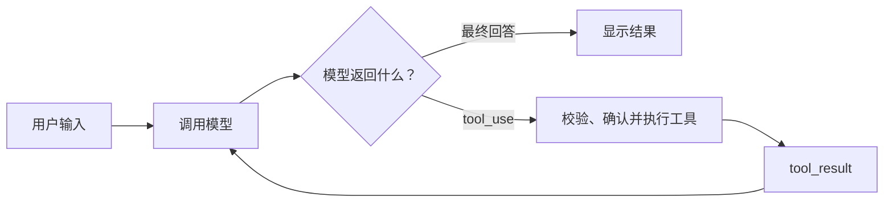
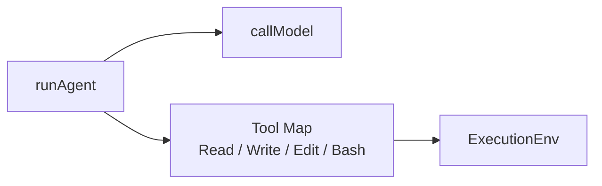
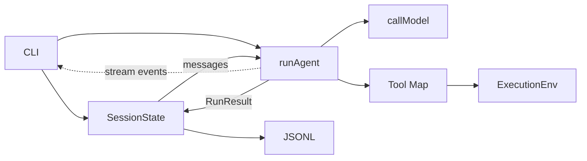
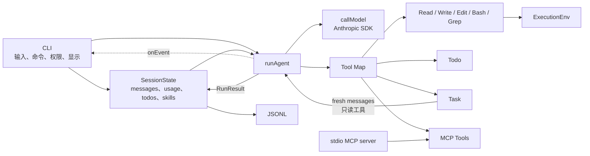
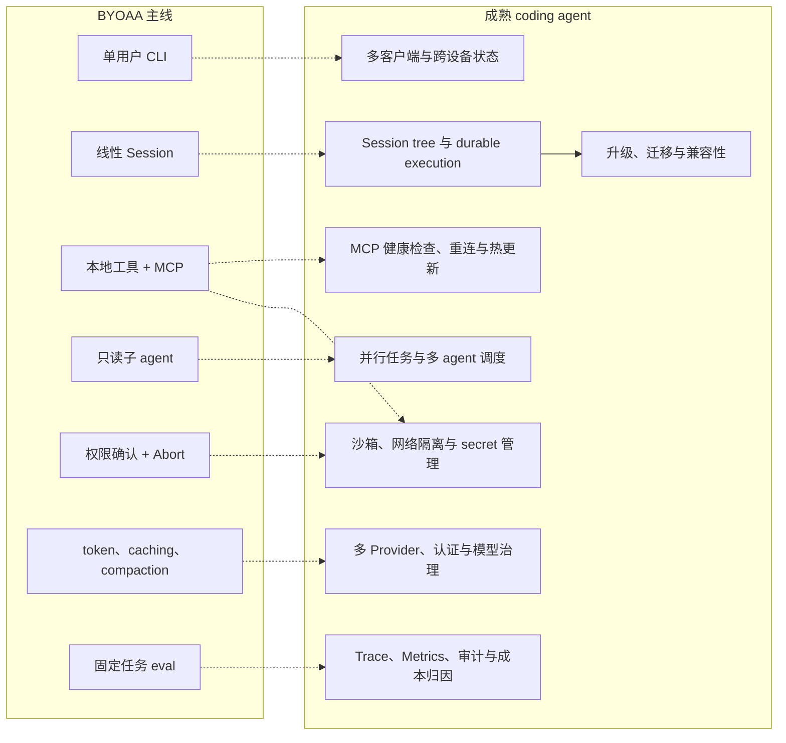

# BYOAA 最终目标设计

> 状态：目标架构
>
> 适用范围：第 16 章完成后的最终参考实现
>
> 最后修订：2026-07-26

> 本文只描述最终成品必须具备的能力和最小实现边界。章节范围以 `OUTLINE.md` 为准，实测约束以 `SPIKE-NOTES.md` 为准；冲突时先改本文。

## 一、最终要造什么

BYOAA 的最终成品是一个单用户、本地运行的终端 coding agent。用户给它一个任务，它能调查代码、修改文件、运行命令、观察结果，并循环到完成或停止。

核心路径只有一条：



最终版本必须支持：

- Anthropic Messages API，第一部分先用 fetch 讲协议，之后改用官方 SDK。
- Read、Write、Edit、Bash、Grep。
- system prompt、cwd、Git 状态和项目指令。
- 写文件、改文件、执行命令和 MCP 工具的权限确认。
- 流式输出、Ctrl+C 取消和可恢复的工具错误。
- token 计数、大输出截断、prompt caching 和 compaction。
- 线性 Session 的 JSONL 保存与恢复。
- Todo、只读子 agent、Skills 和 MCP。
- 固定任务集与确定性 eval。

它不是 Claude Code 的完整替代品，也不提供沙箱、并行调度、分布式执行或企业级安全能力。

## 二、只保留七个核心概念

| 概念 | 职责 |
|---|---|
| CLI | 读取输入、处理斜杠命令、保存会话、显示事件、请求权限 |
| `SessionState` | 保存下一次 prompt 需要继续使用的状态 |
| `runAgent` | 执行一次模型—工具循环 |
| `callModel` | 发起一次 Anthropic 模型调用并返回流式结果 |
| `Tool` | 描述并执行一个工具 |
| `ExecutionEnv` | 提供文件系统和 shell 操作，贯穿取消信号 |
| JSONL 文件 | 在每次 prompt 结束后保存 `SessionState` |

Todo、Task 和 MCP 都是 Tool；Skills 是加入 system prompt 的文本；权限和 compaction 是 `runAgent` 调用的普通函数。它们不需要独立的 Runtime、Manager、Adapter 或状态机。

最终控制关系是：

```text
CLI → runAgent → callModel / Tool → ExecutionEnv
```

`callModel` 通过回调交出 delta，最终 resolve 一条包含完整 assistant message、stop reason 和本次 usage 的响应；测试只需替换这个函数。

## 三、架构图随课程逐步展开

三档图不是三套架构，而是同一套代码在不同章节的真实截面。保留它们是为了让读者看到系统怎样长出来，也让求职面试官能快速判断项目深度；每张图只出现读者已经实现的概念。

### 第一部分结束：核心循环



此时只解释模型—工具循环，以及本地工具怎样落到文件系统和 shell。

### 第 10 章结束：可用的单会话 agent



此时再展示环境、权限、上下文管理、取消和 Session 保存；它们已经在第 6–10 章逐个出现。

### 第 13 章结束：最终能力图



| 图 | 放置位置 | 用途 |
|---|---|---|
| 核心循环图 | 第一部分结束 | 收束 fetch → SDK 与 loop 重构，只画已经写完的内核 |
| 单会话 agent 图 | 第 10 章结束 | 收束环境、权限、上下文、取消和持久化 |
| 最终能力图 | 第 13 章结束、README | 展示 Todo、Skills、子 agent 和 MCP 如何复用同一核心 |

导言仍只展示用户可见的产品闭环，不提前灌输模块名。三张图的价值是“这就是我刚写完的系统”，不是预告以后可能存在的抽象。

## 四、最小数据结构

### Session 状态

```ts
interface Usage {
  inputTokens: number
  outputTokens: number
  cacheReadInputTokens: number
  cacheCreationInputTokens: number
}

interface SessionState {
  messages: Message[]
  usage: Usage
  todos: Todo[]
  skills: string[]
}
```

- `messages` 是下一次发给模型的上下文，compaction 可以改写它。
- `usage` 是会话累计账本，包含主 agent、compaction 和子 agent 的消耗。
- `todos` 和已加载的 `skills` 跨 prompt 保留；`skills` 中每个字符串是已经读入的完整 Skill prompt，不是文件路径。
- “本会话总是允许”的权限记忆只放在 CLI 进程内，不写入 JSONL；重新启动后必须重新授权。

### Tool

```ts
interface Tool {
  name: string
  description: string
  inputSchema: object
  requiresApproval: boolean
  execute(input: unknown, env: ExecutionEnv, signal: AbortSignal): Promise<ToolResult>
}

interface ToolResult {
  content: string
  isError?: boolean
  details?: unknown
}
```

- `content` 发给模型，必须截断过长输出。
- `details` 只给终端显示，例如 Edit 的 diff。
- 模型能根据错误自行修正时，返回 `isError`，不要抛出异常终结整个 run。

所有工具放在一个 `Map<string, Tool>` 中。执行工具只需要一个普通函数：

```text
按名称查找 → 校验参数 → 必要时询问权限 → execute → 返回 ToolResult
```

未知工具、非法参数、用户拒绝和常见执行失败都转成 `isError` 的结果，让模型决定下一步。

### Run 结果

`runAgent` 返回：

```ts
interface RunResult {
  messages: Message[]
  usage: Usage
  reason: "done" | "max_turns" | "aborted" | "failed"
  error?: string
}
```

事件只用于显示过程，最终提交给 Session 的内容以 `RunResult` 为准。

## 五、一次 prompt 怎样运行

1. CLI 检查当前没有其他 run。
2. 读取当前环境，组装 system prompt。
3. 复制 `SessionState.messages`，追加用户消息。
4. 新建 `AbortController`，调用 `runAgent`。
5. `runAgent` 在每次模型请求前处理 token 预算和 compaction。
6. 模型流式返回内容，`runAgent` 把增量交给 CLI 显示。
7. 完整响应到达后：
   - `end_turn`：结束；
   - `tool_use`：执行所有工具，把结果合并成一条 user message，再调用模型；
   - `max_tokens` 截断了 tool use：丢弃这条不完整响应，将 `max_tokens` 加倍但不超过模型上限，最多重试一次；
   - refusal、上下文溢出或不可恢复的 provider 错误：以 `failed` 结束并保留清楚的错误信息。
8. 达到 `maxTurns` 时以 `max_turns` 结束。
9. Ctrl+C 触发 signal，模型请求、子 agent 和工具停止，run 以 `aborted` 结束。
10. `runAgent` 捕获边界内的异常并始终返回 `RunResult`。
11. CLI 用结果更新 `SessionState`，再向 JSONL 追加一行完整状态。

只有结构完整的 assistant message 才能加入 `messages`。不完整的流式 partial 只用于当前屏幕显示，不进入 Session。

无论 `done`、`max_turns`、`aborted` 还是 `failed`，`RunResult.messages` 都保留本 run 已经 settle 的完整 assistant message 和 tool result，usage 也如实累计；最后一条 partial 被丢弃。文件写入和命令等外部副作用不回滚。

## 六、system prompt 与上下文

### System prompt

每次 prompt 调用一个普通函数重新组装：

```text
基础指令
→ 项目指令
→ 已加载 Skills
→ cache breakpoint
→ cwd、Git 状态、时间等易变信息
```

稳定内容放前面，易变内容放后面。项目文件变化后重新读取即可，不为它维护额外状态。

### Token 与大输出

- 工具结果进入 messages 前先截断，保留 head、tail 和被省略的数量。
- 上下文容量使用当前 messages 的 token 估计或最近一次主请求的完整 input token 数判断，不能使用会话累计 usage。启用 caching 时，完整 input token 数为普通 input、cache read 与 cache creation 三者之和。
- usage 账本保留普通 input、cache read、cache creation 和 output，供成本报告使用。
- prompt caching 是否命中必须用 API 返回的 cache usage 字段验证。

### Compaction

设模型窗口为 `contextWindow`。请求前若输入估计达到 `contextWindow - reserveTokens`：

1. 保留原始用户任务。
2. 从末尾保留不超过 `keepRecentTokens` 的完整 messages，不能切断 `tool_use` / `tool_result` 配对。
3. 用一次不带 tools 的模型调用总结中间历史。
4. 用“原始任务 + summary + 最近消息”替换当前 messages。
5. 若压缩后的输入估计没有下降，或仍达到触发线，本 run 直接以 `failed` 结束，不再发起第二次 summary。

`reserveTokens` 为模型输出和一次 summary 留出空间，`keepRecentTokens` 决定最近消息保留多少。两者分开，避免压缩后的上下文仍高于触发线而每轮重复压缩。

不实现第二套“溢出后自动压缩”流程。主动压缩仍未避免溢出时，本次 run 清楚地失败，用户可以 `/compact` 后重试。

## 七、权限、错误和取消

### 权限

- Read 和 Grep 默认允许。
- Write、Edit、Bash 和 MCP 工具默认询问。
- 参数先校验，合法后才询问用户。
- 用户可以允许一次、拒绝或在当前进程内总是允许。
- “总是允许”只记住相同操作范围：Write / Edit 按目标路径，Bash 按完整命令，MCP 按 server 与 tool 名；不能因为允许过一次 Bash 就放行所有命令。
- 子 agent 只拿只读工具，因此不再逐次询问写权限。

权限弹窗不是沙箱。工具仍然在用户机器和当前权限下运行。

### 错误

- 非法参数、文件不存在、替换文本没找到和 MCP 调用失败返回 `isError` 的 `ToolResult`。
- Bash 非零退出是模型需要观察的命令结果：把 exit code、stdout 和 stderr 放进普通 `ToolResult`；只有进程无法启动或超时才标记 `isError`。
- 程序错误、provider 最终失败等无法让模型自行修正的问题才结束 run。
- 限速和连接建立阶段的瞬时错误在 `callModel` 内最多重试两次，并且只允许发生在首个 delta 之前。
- 流已经输出内容后若连接中断，不透明重试；丢弃未完成 assistant message，以 `failed` 结束，Session 仍可继续使用。

### 取消

每个主 run 只有一个 `AbortController`。同一个 signal 传给：

- 模型请求；
- 当前工具；
- Bash 子进程；
- 子 agent；
- MCP 调用。

Shell 停止子进程时依次关闭 stdin、发送 SIGTERM，仍未退出再发送 SIGKILL。

## 八、Session 保存与恢复

CLI 同时只允许一个 run。每次 prompt settle 后，向 Session 的 JSONL 文件追加一行完整 `SessionState`：

```text
prompt 1 的状态
prompt 2 的状态
prompt 3 的状态
...
```

恢复时从后往前读取最后一条能解析为 JSON 且通过 `SessionState` 字段校验的记录。保存完整状态会重复占用磁盘，但恢复只需要反序列化，不需要重放工具调用或 compaction。

当前版本不支持：

- run 中途进程崩溃后继续未完成任务；
- 工具副作用回滚；
- Session 分支、撤销或合并；
- 权限记忆跨进程恢复。

## 九、现有能力如何落在核心路径上

### Todo

Todo 是一个普通工具，读写 `SessionState.todos`。它不使用模块级全局变量，也不给只读子 agent。

### 子 agent

Task 也是一个 Tool。它直接调用同一个 `runAgent`，但使用：

- 全新的 messages；
- 只含 Read 与 Grep 的 Tool Map，不包含 Task、Todo 或 MCP；
- 主 run 的 AbortSignal；
- 自己的 `maxTurns`；
- 收窄后的调查 prompt。

因此子 agent 深度固定为一层，不能再启动子 agent。它的最终文本成为父 agent 的一条 tool result，usage 加入父 run。结果必须附文件路径、行号或命令输出，让父 agent 可以复查；自然语言结论本身不算证据。

当前只实现只读子 agent。写操作子 agent 和 git worktree 隔离留在练习中。

### Commands 与 Skills

CLI 用一个 `switch` 处理 `/help`、`/compact`、`/resume` 等命令，不建命令框架。

Skill 是按需读入的文本。加载后加入 `SessionState.skills`，下一次 system prompt 带上它；未加载时不占 token。

### MCP

CLI 启动配置中的 stdio server，完成 JSON-RPC 握手和 `tools/list`，再把远程工具包装成普通 Tool 放进同一个 Map。

- server 与 tool 名中的非法字符先替换为 `_`，最终工具名统一为 `mcp__<server>__<tool>`；最终名称不匹配 `^[a-zA-Z0-9_-]{1,64}$` 或与已有工具冲突时，启动阶段拒绝注册。
- 非文本结果在发给模型的 `content` 中变成简短占位文本，原始 block 放进 `details` 给终端使用。
- 启动失败：显示警告并跳过该 server。
- 调用失败：返回 `isError` 给模型。
- CLI 退出：关闭保存着的子进程句柄。

当前不实现自动重连、热更新、独立 Manager 或动态下架策略。

### 终端显示

`runAgent` 只接受一个 `onEvent` 回调，报告文本增量、工具开始/结束、compaction 和 run 结束。CLI 直接把事件交给渲染函数；不建 EventBus，也不用第二套记录协议。

### Eval

Eval 运行固定任务，按测试是否通过、文件内容是否匹配来判分，并报告 usage。

`runAgent` 接受一个 `callModel` 函数：正常运行时传 Anthropic 实现，测试时传按脚本返回固定响应的函数。不为此建立 Provider 层或 Faux Provider 类。

## 十、依赖和实现纪律

- `runAgent` 不读取终端输入，不直接写 JSONL，不持有跨 prompt 状态。
- Tool 不负责 Session 保存。
- 本地 Tool 只通过 `ExecutionEnv` 操作文件和 shell。
- Task Tool 通过闭包调用 `runAgent`，不要让 `runAgent` import Task。
- MCP 工具与本地工具进入同一个 Map，loop 不区分来源。
- 先写具体实现；只有出现真实重复时再拆文件或抽接口。
- 中间章节不预留空回调、空模块或最终目录。每章只加入当章已经需要的代码，并保持可运行。

## 十一、与生产级 coding agent 的差距

BYOAA 证明的是 coding agent 核心机制可以被从零实现，不是几千行代码已经等价于成熟产品。下面这张图用于 README、结尾和求职讲解：左边是本书交付，右边是生产系统还必须解决的问题。



这条边界本身是项目成果的一部分：它说明作者知道哪些机制已经实现、哪些只是被简化，以及继续走向生产会遇到什么工程问题。

## 十二、为什么明确不做

“不做”不表示这些能力不重要，而是它们引入的复杂度明显大于在本课程中的新增教学价值。

| 不做的能力 | 会引入的主要复杂度 | 教学性价比判断 |
|---|---|---|
| 通用多 Provider、插件和 Extension 框架 | 流式事件、tool schema、错误、认证和模型能力的统一协议；版本与兼容性管理 | 附录实现一个 OpenAI-compatible 调用已足以展示适配边界；继续框架化主要是在教 SDK 兼容层，不再是在教 agent |
| server-side compaction | provider-specific beta、服务端状态和手写历史的混合语义 | 手写 compaction 才能让读者看见触发、切点和信息丢失；服务端版本反而遮住本章主角 |
| 并行工具、后台任务和多 agent 调度 | 调度器、共享状态、竞态、结果排序、联合取消和预算分配 | 顺序 loop 已经完整展示 agent 机制；新增大部分内容属于并发系统 |
| 写操作子 agent | worktree 生命周期、diff 审查、冲突合并、失败清理和权限继承 | 只读子 agent 已经证明上下文隔离和 loop 复用；写隔离留作练习即可 |
| MCP 自动重连、热更新和动态下架 | 健康状态、退避、工具表变更、在途调用处理和 cache 失效 | 握手、`tools/list`、`tools/call` 和关闭进程已经覆盖 MCP 的核心教学目标 |
| Session tree、事务恢复和 run 中途崩溃续跑 | WAL、checkpoint、幂等、工具副作用重放、分支与合并语义 | 每个 prompt 结束保存完整状态已能教清持久化边界；再往前会变成 durable workflow 课程 |
| 容器沙箱、网络隔离和 secret 管理 | OS/container 隔离、挂载和网络策略、凭据注入、威胁模型 | 权限确认足以教“执行前征得同意”，但必须明说它不是安全隔离；真正沙箱值得单独成课 |
| 完整 Trace、审计、配额和组织策略 | telemetry schema、数据脱敏、存储查询、留存和治理规则 | usage 汇总与确定性 eval 已能回答“效果和成本有没有变好”；企业治理不是当前读者理解 agent 的必要条件 |
| 完整 TUI、IDE、Web 和跨设备客户端 | UI 状态、IPC/服务端协议、同步、跨平台打包和升级 | CLI 已足以展示流式、diff、工具状态和权限交互；多客户端不会增加 agent 原理的理解 |

统一判据是：

> 如果删掉一项能力后，读者仍能亲手理解并实现 coding agent 的核心闭环，而保留它会迫使课程转去讲另一门大型工程主题，就不进入正文主线。

### 不做不等于不知道

求职作品需要诚实区分四种证据：

| 等级 | 证据要求 | 适用范围 |
|---|---|---|
| Implemented | 主分支代码、测试、demo、指标，能解释实现细节 | 正文承诺的核心能力 |
| Spiked | 独立分支或番外中的最小实验，验证关键风险，不承诺产品完整度 | 少数高信号的生产能力 |
| Designed | 写清需求、不变量、失败模式、数据流和测试方案，不声称已经实现 | 与目标岗位相关但实现成本过高的能力 |
| Aware | 知道它解决什么问题、为什么超出当前范围 | 更外围的平台与企业能力 |

只有 `Implemented` 的能力进入正文最终成品清单。`Spiked`、`Designed` 和 `Aware` 可以体现工程视野，但必须在 README、文章和面试中明确标注，不能把设计理解包装成实现成果。

一项能力即使不亲手实现，至少也要能回答：

1. 它解决什么真实问题？
2. 简单方案为什么不够？
3. 最重要的不变量是什么？
4. 最危险的失败模式是什么？
5. 应该怎样测试？
6. 为什么它没有进入正文？

做到这些可以支撑 design-level 面试讨论；若要声称掌握实现细节，则必须至少做过 spike。

### 正文完结后的番外

番外适合承载少数值得 hands-on、但会让正文失焦的能力。规则是：

- 先完成并发布独立成立的正文 1.0，再做番外。
- 最多优先选择一到两个高信号主题，不把所有“不做”变成 backlog。
- 番外使用独立文章和 git tag，不改变 `chapter-01` 至 `chapter-16` 的核心路径。
- 番外可以复用正文代码，但正文不能反向依赖番外。
- 每个番外都要有可见的失败案例、最小实现和对抗测试，不能只增加结构。

优先级最高的两个候选是：

1. **Permission 不等于 Sandbox**：在一个明确的 OS / runtime 上限制 workspace 外写入、敏感目录读取、网络访问和后代进程；使用成熟隔离原语，不自己发明安全边界。
2. **写操作子 agent + git worktree**：子 agent 在隔离 worktree 修改，主 agent 审查 diff 和测试结果，再合并或清理；至少演示一次取消或冲突。

durable session、并行调度、MCP 重连、多 Provider 平台和完整 observability 默认先写成 design note。只有目标岗位明确重视其中某项，且核心成品已经打磨完成，才升级为 spike 或番外。

### 在作品、文章和面试中怎样呈现

README 最终放一张完整的能力证据矩阵。下面记录的是 **1.0 的目标证据等级和验收方式，不代表当前完成状态**；实际 README 必须随里程碑更新为真实状态。

正文能力全部以 `Implemented` 为目标：

| 正文能力 | 目标等级 | 至少提供的证据 |
|---|---|---|
| Anthropic API：fetch → SDK | Implemented | 原始 request / response、双版本等价运行、SDK 迁移说明 |
| Tool use 协议与 agent loop | Implemented | tool_use / tool_result transcript、并行结果配对测试、终止与 maxTurns 测试 |
| Read / Write / Edit / Bash / Grep | Implemented | 修复真实 bug 的端到端 fixture、错误输入和大输出测试 |
| `ExecutionEnv` 与进程控制 | Implemented | 文件 / shell fake 测试、超时和无孤儿进程验证 |
| system prompt、环境与项目指令 | Implemented | 注入前后对比、cwd / Git / 项目约定验收 |
| 权限系统 | Implemented | allow / deny / 当前会话记忆测试、拒绝后的模型行为记录 |
| 流式、网络重试、工具错误与 Abort | Implemented | 429 / 中断 / 工具失败故障注入、Ctrl+C 后继续会话 |
| token 计数、大输出截断、prompt caching | Implemented | 截断 fixture、cache usage 命中、调用成本对比 |
| Compaction | Implemented | 长上下文 demo、安全切点测试、原始任务保留、无 thrash 验证 |
| JSONL Session 保存与恢复 | Implemented | 关闭重开恢复、损坏尾行处理、权限记忆不恢复测试 |
| Todo、Commands 与 Skills | Implemented | 多步任务开关对比、斜杠命令 demo、未加载 Skill 不占 token |
| 只读子 agent | Implemented | 主 / 子 messages 隔离、只读边界、usage 汇总、证据可复查 |
| MCP client | Implemented | 真实 server 握手、分页、调用、失败降级和进程关闭测试 |
| 终端 Renderer | Implemented | 流式 Markdown、diff、折叠和权限交互 GIF |
| 确定性 eval | Implemented | 固定任务集、自动判分、功能与 token / 成本对比报告 |
| npm 发布与 CI 冒烟 | Implemented | 干净环境全局安装、三分钟 demo、发布 CI |

正文之外的能力也要明确证据等级：

| 边界能力 | 目标等级 | 至少提供的证据 |
|---|---|---|
| OpenAI-compatible 调用 | Implemented（附录） | 用同一最小任务跑通兼容端点，说明与正文边界 |
| 通用多 Provider / 插件框架 | Aware / Designed | 适配维度、版本兼容成本和不框架化理由 |
| server-side compaction | Aware | 与手写版的能力、模型支持和教学价值对比 |
| 并行工具、后台任务、多 agent 调度 | Designed | 调度、竞态、取消、预算和结果排序方案 |
| 写操作子 agent + worktree | Spiked（优先番外） | 隔离修改、diff 审查、测试、取消或冲突 demo |
| MCP 重连、热更新、动态下架 | Designed | 健康状态、退避、在途调用和工具表变化方案 |
| durable session、Session tree、崩溃续跑 | Designed | failure model、checkpoint / 幂等边界和测试计划 |
| Sandbox、网络隔离、secret 管理 | Spiked（优先番外）或 Designed | 越界写、敏感读取、网络和后代进程对抗测试，或完整威胁模型 |
| Trace、审计、配额和组织策略 | Aware / Designed | 最小 telemetry schema、脱敏和成本归因说明 |
| 完整 TUI、IDE、Web、跨设备 | Aware | 客户端协议与状态同步边界，不声称已经实现 |

文章分三类：

- 正文章节：教读者亲手完成核心 agent。
- 结尾边界文章：解释从教学 agent 到生产 harness 还差什么。
- 独立番外：记录经过实现或实验验证的生产能力。

面试回答按“问题 → 正文做到哪里 → 为什么停下 → 我有什么证据 → 产品化下一步”展开。最有说服力的不是功能列表最长，而是每一项能力的证据等级清楚、每一处停止都有可验证的工程理由。

时间投入默认按 **75% 核心实现与验证、15% 一个高信号番外、10% 边界文档和面试整理** 分配。以后若真有产品需求，可以修改现有代码再实现；当前不为番外预留结构。

## 十三、教学顺序

本文描述的是第 16 章结束时的形状，不是第一章的脚手架。章节仍按 `OUTLINE.md` 渐进构建：

- 先看清 HTTP、tool use 和 agent loop；
- 再加入写文件、Bash、环境、权限和上下文管理；
- 最后加入 Session、子 agent、Skills、MCP、终端体验和 eval。

每个抽象必须由读者已经遇到的问题引出。没有当前问题支撑的抽象，不提前加入。
